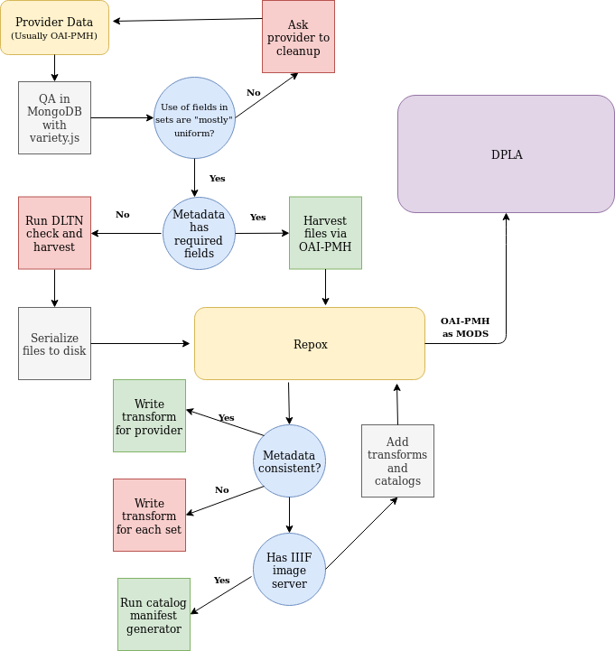

========================
Aggregation and Harvests
========================

The Digital Library of Tennessee attempts to make participation and sharing content as easy as possible. Below is an
explanation of how content is harvested from providers into UTK's Repox instance and shared to the the Digital Public Library of America.

------------
Our Workflow
------------

Content is usually submitted from providers to DLTN via OAI-PMH.  While no specific metadata format is required, MODS or
OAI QDC is preferred. Before adding a new set or provider, metadata is harvested from partners and ingested into MongoDB.
The aggregation team at the University of Tennessee then checks for metadata consistency and required fields with
dltn_metadata_QA and `variety.js <https://github.com/variety/variety>`_.

If a set has all required fields, the set is harvested directly via OAI-PMH into our aggregation software, Repox.  If a
set is missing required fields or has is not technically OAI-PMH compliant, the set is harvested with
`dltn_check_and_harvest <https://github.com/variety/variety>`_. Since we map metadata from incoming formats to MODS with
XSLT, ignoring records causes our MODS OAI-PMH to not be compliant to the standard.  For that reason, we serialize to
disk only the records that meet our minimum requirements before we add to Repox.

Next, XSLT transforms are written for each provider. If metadata from providers are consistent across sets, one transform
is written for the provider.  If not, transforms are written for each set. Our transforms are maintained in the `DLTN XSLT <https://github.com/digitallibraryoftennessee/dltn_Xslt>`_
repository along with sample data.  To make transforms as easy to maintain as possible, all new transforms require an
identity transform.  **Note**: some legacy transforms do not have an identity transform.

As part of our transformation to MODS, we add IIIF manifests to metadata records where possible so that DPLA can add high
resolution images to its web interace over the IIIF API. To make this easy for ContentDM users, we generate and maintain
a catalog of records with IIIF manifests up to date with our `ContentDM Catalog Manifest Generator <https://github.com/DigitalLibraryofTennessee/contentdm_catalog_manifest_generator>`_.
This is necessary because compound objects from ContentDM do not have manifests (only parts / pages do).

Once the mapping has been written, it and the catalog (if it exists) are added to Repox and associated with the set.

References
==========

* `ContentDM Catalog Manifest Generator <https://github.com/DigitalLibraryofTennessee/contentdm_catalog_manifest_generator>`_
* `DLTN XSLT <https://github.com/digitallibraryoftennessee/dltn_Xslt>`_
* `Variety.js <https://github.com/variety/variety>`_

