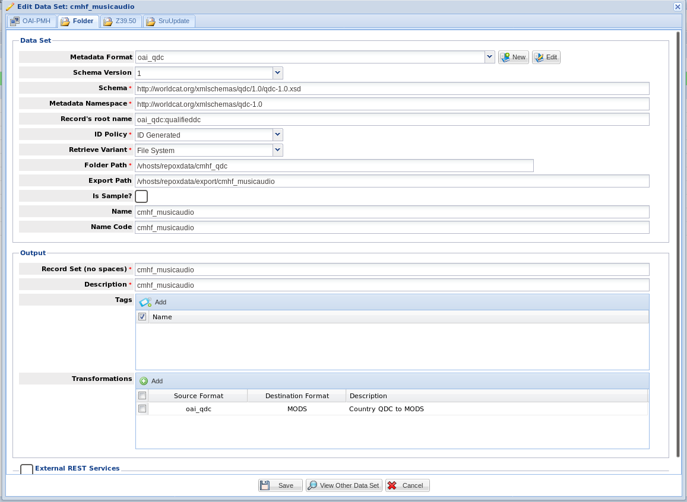

=================
Check and Harvest
=================

-----
About
-----

`Check and Harvest <https://github.com/DigitalLibraryofTennessee/check_and_harvest>`_ is a tool used by the Digital
Library of Tennessee to harvest metadata from sets with bad metadata.  There are a few reasons why this tool is valuable
to our work flows:

1. Since we use Repox for aggregation and transformation of metadata, we need an extra tool to keep our provider OAI
compliant.  This is due to the fact that transforms can only be applied to the **/OAI-PMH/ListRecords/record/metadata**
section of a metadata record.  Because of this, any transform that attempts to remove records that don't meet our
minimum standards for inclusion into DPLA results in a record with an empty metadata node (not OAI compliant!)

2. Some providers include metadata records in their sets that do not have a resolvable URI to the object or its
derivatives. Because of this, in order to meet DPLA's requirements, we would have to exclude thousands of records
because of 2 or 3 bad objects.

----------
How to Use
----------

Before Adding a New Set or Reharvesting an Existing Set
=======================================================

During quarterly harvests, you should always run check and harvest against a new set or existing set that you are
reharvesting from to ensure there has been no bad data added.  During this part of the process, you do not need to worry
about harvesting unless you are confident there will be problems.  If this is a reharvest, you can just do a *check*
unless this is a set that we already add via direct folder upload. If we already add via direct folder upload, go ahead and
harvest.  There are a few ways to tell whether or not something is added via direct file upload, but the easiest method
is probably just to check the Repox GUI.  If it looks like this, do a Harvest:

If you only need to do a *check*, run this command:

.. code-block:: console

    $ python run -e http://the_providers_oai_endpoint -m their_metadata_format -s the_set_in_question -tu True -H False

If you are confident that the only problem that could occur is bad metadata, you can ignore testing urls and run this
much faster *check*:

.. code-block:: console

    $ python run -e http://the_providers_oai_endpoint -m their_metadata_format -s the_set_in_question -H False

After Your Check
================

If you run a check, and it passes, you don't need to do a harvest and can simply add the set to Repox via the standard
OAI-PMH method.

If it doesn't pass, we can do a few things:

First, notify the partner that they have bad metadata.  You can tell them which records are bad in two ways:

1. During a check, any bad records found will be appended to the **bad_records.log** file.  You can copy the records out
of the log, but remember these will be in a dict-like format.

2. You can *harvest* the bad records only like below.  This will allow you to share the specific bad XML records:

.. code-block:: console

    $ python run -e http://the_providers_oai_endpoint -m their_metadata_format -s the_set_in_question -tu True -H True -w bad

Next, go ahead and *Harvest* the good records only from the set like so.  Keep in mind, you need to cleanup your output
directory after each harvest:

.. code-block:: console

    $ python run -e http://the_providers_oai_endpoint -m their_metadata_format -s the_set_in_question -tu True -H True

Adding the Files to the DPLA server
===================================

Once you've harvested your good records, you need to add them to Repox.  You **must** first upload these to the server.
Historically, we have added these to this path **/vhosts/repoxdata**.

If you're working on a reharvest / existing set, upload your records to the same path. By doing this, you don't need to
do anything in the GUI.  You can find the existing path by looking at the set in the GUI:

If you're adding a brand new set, upload your files then define the new set as a folder upload in the GUI.

